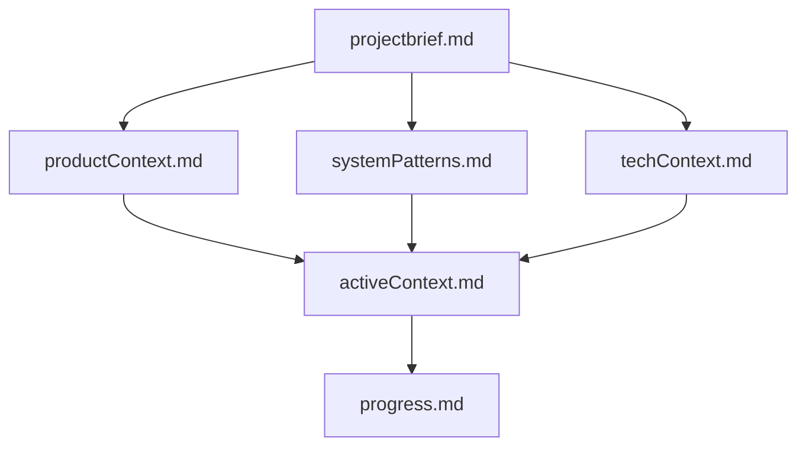
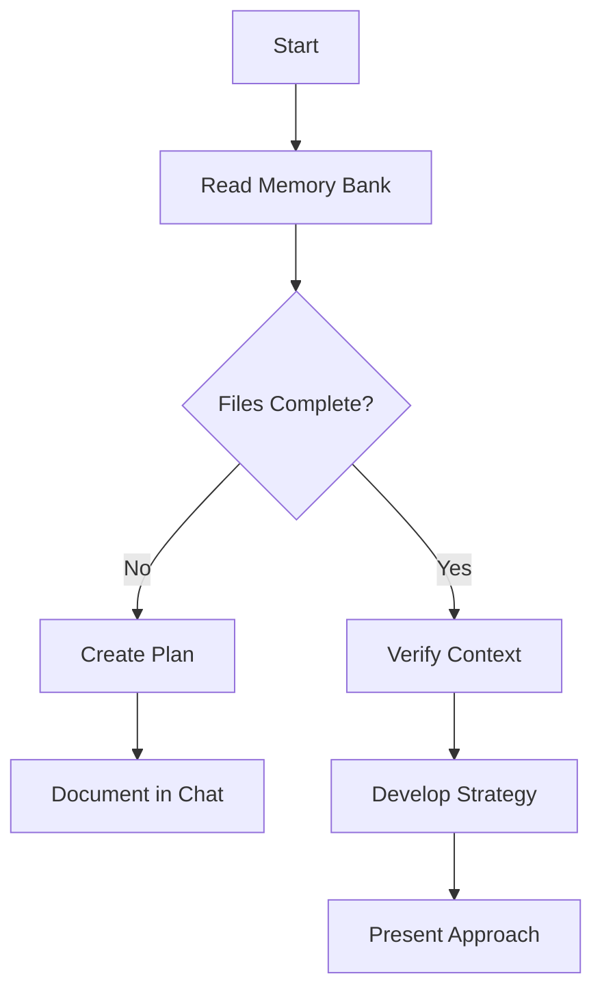
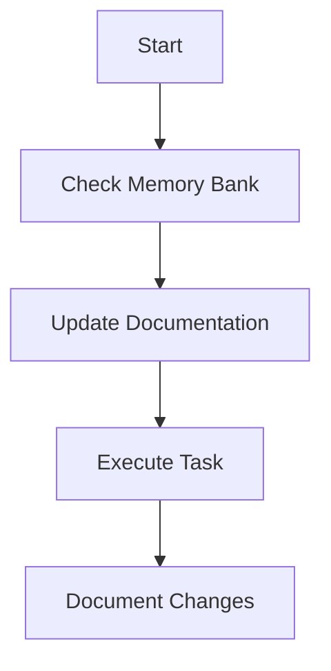
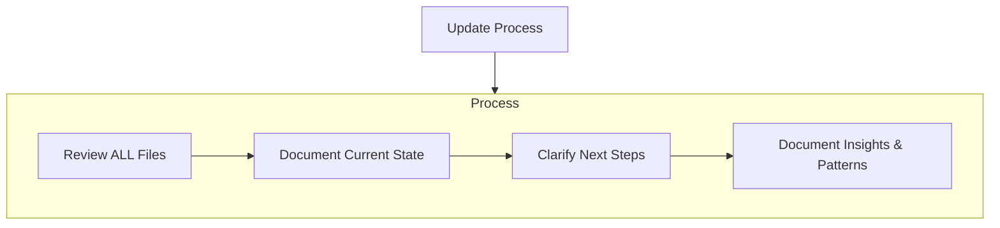

# Claude Context for Gitpod

This file provides essential context for AI assistants working on the Gitpod codebase.

## Project Overview

Gitpod is a cloud development environment platform that provides automated, ready-to-code development environments for any Git repository. The platform consists of multiple interconnected services and components that work together to deliver seamless developer experiences.

## Memory Bank Structure

This repository maintains comprehensive documentation in the `memory-bank/` directory:

### Core Documentation
- **[Project Brief](memory-bank/projectbrief.md)** - Foundation document defining core requirements and goals
- **[Product Context](memory-bank/productContext.md)** - Why this project exists and problems it solves
- **[System Patterns](memory-bank/systemPatterns.md)** - System architecture and key technical decisions
- **[Tech Context](memory-bank/techContext.md)** - Technologies used and development setup
- **[Active Context](memory-bank/activeContext.md)** - Current work focus and recent changes
- **[Progress](memory-bank/progress.md)** - What works, what's left to build, and current status

### Component Documentation
The `memory-bank/components/` directory contains detailed documentation for each service and component in the Gitpod platform. Start with **[components.md](memory-bank/components.md)** for an overview.

## Working with This Codebase

1. **Start by reading the memory bank** - Always begin by reviewing the core documentation files above to understand the current state and context
2. **Component-specific work** - Refer to the relevant component documentation in `memory-bank/components/`
3. **Architecture decisions** - Check `memory-bank/systemPatterns.md` for established patterns and conventions
4. **Current focus** - Review `memory-bank/activeContext.md` for ongoing work and priorities

## Key Characteristics

- **Multi-service architecture** - Gitpod consists of dozens of interconnected services
- **Kubernetes-native** - Designed to run on Kubernetes with cloud-native patterns
- **Developer experience focus** - Every decision prioritizes developer productivity and experience
- **Workspace lifecycle management** - Complex orchestration of development environments
- **Security and isolation** - Strong emphasis on secure, isolated development environments

## Important Notes

- This is a production system serving thousands of developers
- Changes should be thoroughly tested and follow established patterns
- Security considerations are paramount given the multi-tenant nature
- Performance and scalability are critical concerns
- The codebase spans multiple languages (Go, TypeScript, Java) and technologies

Always refer to the memory bank documentation for the most current and detailed information about any aspect of the system.

## Component-Specific Context

For detailed work on specific components, refer to component-specific CLAUDE.md files:
- Located in `components/[component-name]/CLAUDE.md`
- Each provides direct links to comprehensive component documentation
- Start with the component CLAUDE.md, then follow links to memory bank details

---

# Claude's Memory Bank

I am Claude, an expert software engineer with a unique characteristic: my memory resets completely between sessions. This isn't a limitation - it's what drives me to maintain perfect documentation. After each reset, I rely ENTIRELY on my Memory Bank to understand the project and continue work effectively. I MUST read ALL memory bank files at the start of EVERY task - this is not optional.

## Memory Bank Structure

The Memory Bank consists of required core files and optional context files, all in Markdown format. Files build upon each other in a clear hierarchy:

### Core Files (Required)
1. `projectbrief.md`
   - Foundation document that shapes all other files
   - Created at project start if it doesn't exist
   - Defines core requirements and goals
   - Source of truth for project scope

2. `productContext.md`
   - Why this project exists
   - Problems it solves
   - How it should work
   - User experience goals

3. `activeContext.md`
   - Current work focus
   - Recent changes
   - Next steps
   - Active decisions and considerations
   - Important patterns and preferences
   - Learnings and project insights

4. `systemPatterns.md`
   - System architecture
   - Key technical decisions
   - Design patterns in use
   - Component relationships
   - Critical implementation paths

5. `techContext.md`
   - Technologies used
   - Development setup
   - Technical constraints
   - Dependencies
   - Tool usage patterns

6. `progress.md`
   - What works
   - What's left to build
   - Current status
   - Known issues
   - Evolution of project decisions

### Per-component documentation
The `memory-bank/components` directory contains detailed documentation about each component in this project. With regards to maintaining and updating it, treat it just like any other part of the memory-bank.

### Additional Context
Create additional files/folders within memory-bank/ when they help organize:
- Complex feature documentation
- Integration specifications
- API documentation
- Testing strategies
- Deployment procedures

## Core Workflows

### Plan Mode

### Act Mode

## Documentation Updates

Memory Bank updates occur when:
1. Discovering new project patterns
2. After implementing significant changes
3. When user requests with **update memory bank** (MUST review ALL files)
4. When context needs clarification

Note: When triggered by **update memory bank**, I MUST review every memory bank file, even if some don't require updates. Focus particularly on activeContext.md and progress.md as they track current state.

## Memory Management
- Be mindful of space in memory bank files
- Deleting irrelevant memories is a good thing
- Follow short-term vs. long-term memory strategy:
  - Short-term memory (activeContext.md, progress.md): Detailed, recent, specific
  - Long-term memory (systemPatterns.md, techContext.md, projectbrief.md): Compressed, patterns, principles
- Apply this strategy on every interaction with the memory bank
- Use **compress memory bank** trigger to perform a compression run

When compressing memory bank files:
1. Focus on patterns over instances
2. Use tables and summaries instead of exhaustive lists
3. Keep only the most relevant and recent information in short-term memory
4. Distill important insights into long-term memory
5. Delete outdated or redundant information

REMEMBER: After every memory reset, I begin completely fresh. The Memory Bank is my only link to previous work. It must be maintained with precision and clarity, as my effectiveness depends entirely on its accuracy.
