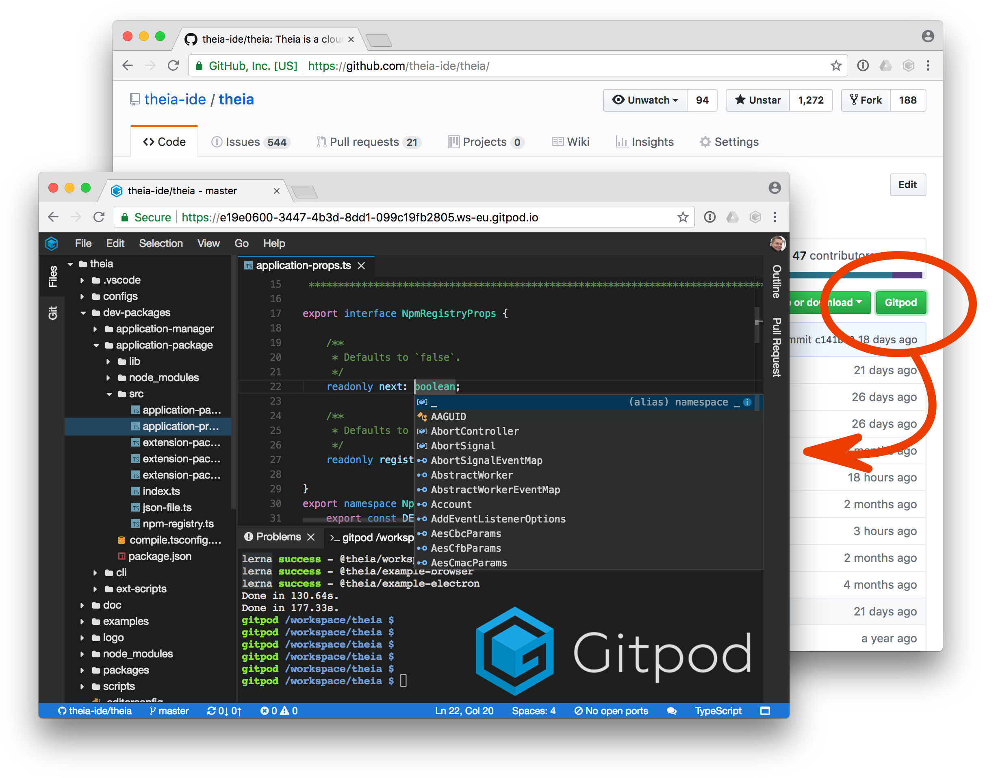

# Gitpod - One-Click Online IDE for GitHub

[Gitpod](https://gitpod.io) provides an online IDE with a complete terminal for any GitHub project.
It comes with tight GitHub-integration to keep you in the flow.

Simply prefix any GitHub URL with `gitpod.io/#`.

This repository is used for bug tracking and feature requests. Feedback is welcome! :heart:

