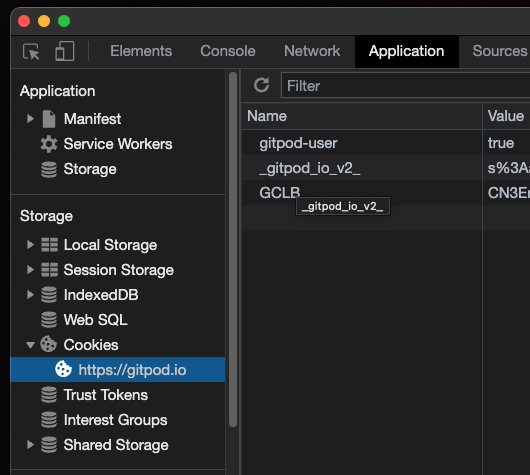

# Dashboard

The dashboard is written in TypeScript and React. For styling it uses TailwindCSS which is a bit nicer than inlining CSS as it supports pseudo classes and a is a little more abstract/reusable.

The `App.tsx` is the entry point for the SPA and it uses React-Router to register all pages.

```ts
<Switch>
  <Route path="/" exact component={Workspaces} />
  <Route path="/profile" exact component={Profile} />
  <Route path="/notifications" exact component={Notifications} />
  <Route path="/subscriptions" exact component={Subscriptions} />
  <Route path="/env-vars" exact component={EnvVars} />
  <Route path="/git-integration" exact component={GitIntegration} />
  <Route path="/feature-preview" exact component={FeaturePreview} />
  <Route path="/default-ide" exact component={DefaultIDE} />
</Switch>
```

Pages are loaded lazily using `React.lazy` so that not everything needs to be loaded up-front but only when needed:

```ts
const Notifications = React.lazy(() => import('./account/Notifications'));
const Profile = React.lazy(() => import('./account/Profile'));
const Subscriptions = React.lazy(() => import('./account/Subscriptions'));
const DefaultIDE = React.lazy(() => import('./settings/DefaultIDE'));
const EnvVars = React.lazy(() => import('./settings/EnvVars'));
const FeaturePreview = React.lazy(() => import('./settings/FeaturePreview'));
const GitIntegration = React.lazy(() => import('./settings/GitIntegration'));
```

Global state is passed through `React.Context`.

After creating a new component, run the following to update the license header:
`leeway run components:update-license-header`

## How to develop in gitpod.io

✍️ Edit `craco.config.js`:

- Add a `devServer` section:

```js
     devServer: {
         proxy: {
             '/api': {
                 target: 'https://' + GITPOD_HOST,
                 ws: true,
                 headers: {
                     host: GITPOD_HOST,
                     origin: 'https://' + GITPOD_HOST,
                     cookie: '__REPLACE_YOUR_COOKIE__'
                 },
             }
         }
     }
```

- Replace `GITPOD_HOST` with _SaaS Gitpod host_ (e.g. `gitpod.io`) or _self-hosted Gitpod host_ (e.g. the base URL of your target self-hosted Gitpod)
- Replace `__REPLACE_YOUR_COOKIE__` with the stringified value of your auth cookie taken from your browser's dev tools while visiting your target Gitpod host (e.g. `_gitpod_io_=s%3Axxxxxxxx-xxxx-xxxx-xxxx-xxxxxxxxxxxx.XXXXXXXXXXXXXXX` for `gitpod.io`).
  

🚀 After following the above steps, run `yarn run start` to start developing.

## Tests

The dashboard uses 🌳 [Cypress](https://www.cypress.io/) for integration tests.
Specs are written with 🦑 [Cypress Testing Library](https://testing-library.com/docs/cypress-testing-library/intro/).

### How to run tests in watch mode

Open a terminal, launch the dashboard app (see instructions above):

```sh
yarn start
```

When the dashboard app is up and running, open another terminal **using Bash as shell** (this is mandatory at the moment) and launch Cypress:

```sh
yarn test:integration:watch
```

Then open port 6080 in the browser and you should see Cypress' interface via VNC.
Proceed as usual with Cypress from there.

### How to run tests in batch mode

Open a terminal, launch the dashboard app (see instructions above):

```sh
yarn start
```

When the dashboard app is up and running, open another terminal and launch Cypress:

```sh
yarn test:integration:run
```

You should see Cypress running in the terminal.
