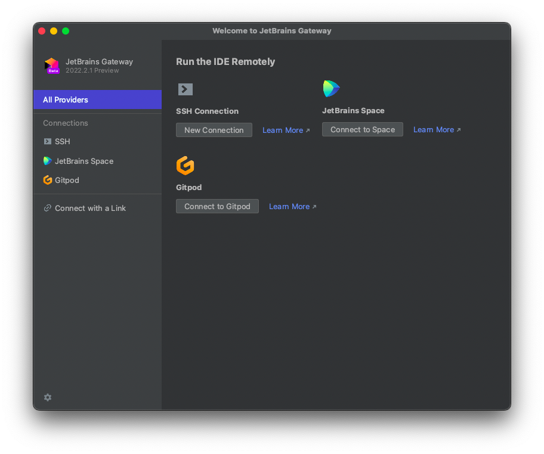

## Gitpod Gateway

<!-- Plugin description -->
Provides a way to connect to Gitpod workspaces.

<!-- Plugin description end -->

This plugin is based on the [IntelliJ Platform Plugin Template](https://github.com/JetBrains/intellij-platform-plugin-template).

## Development

This project is not Gitpodified yet because it requires running the JetBrains Gateway locally. For now, for development, contributors can use [IntelliJ IDEA](https://www.jetbrains.com/idea/) installed on their machines.

## Testing

For testing purposes, it's possible to build the plugin and launch a JetBrains Gateway instance which comes with the dev build of the plugin pre-installed.

Run:

```console
./gradlew runIde
```

If you want to open a real workspace in the dev build, follow these steps:

1. Start a workspace
2. Open the terminal and run
    ```console
    curl http://localhost:24000/gatewayLink

    # This will output something like:
    # jetbrains-gateway://connect#gitpodHost=gitpod.io&workspaceId=andreafalze-gitpodexper-4xasfqb42zr&backendPort=63342
    ```
3. Copy the output value
4. Go to your local terminal and run:
    ```console
    ./gradlew runIde --args="jetbrains-gateway://connect#gitpodHost=gitpod.io&workspaceId=andreafalze-gitpodexper-4xasfqb42zr&backendPort=63342"
    ```

For executing the tests and the static analysis validations, run:

```console
./gradlew check
```

**Note**: Gradle should run with Java 11.

## How to test from a Pull Request

- Ensure you have the latest JetBrains Gateway installed: https://www.jetbrains.com/remote-development/gateway/
- Download this Gateway Plugin build, from Gitpod's Plugin Dev Channel: https://plugins.jetbrains.com/plugin/18438-gitpod-gateway/versions/dev
- Install it on the Gateway following these instructions: https://www.jetbrains.com/help/idea/managing-plugins.html#install_plugin_from_disk
- Do the checks requested by the pull request creator or do a full manual test as instructed below.

## Checklist for a Full Manual Test

- Check if you can create a new workspace
- Check if you can connect to a running workspace
- Check if you can connect to a stopped workspace
- Check if changing the "Gitpod Host" in Preferences >> Tools >> Gitpod takes effect
- Check if the info displayed in the workspaces list is matching what you see on the Web App Dashboard
