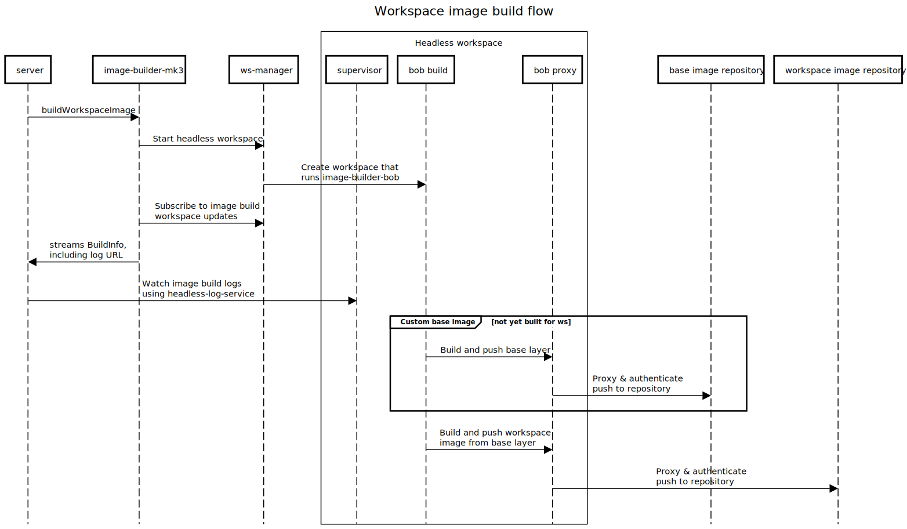

# image-builder-mk3

`image-builder-mk3` is a service that runs in meta clusters, which provides APIs to create and list workspace image builds, resolve workspace docker image references, and listen to build updates and logs.

> Once completed, [#7845](https://github.com/gitpod-io/gitpod/issues/7845) will move `image-builder-mk3` (and image builds) from meta to workspace clusters.

The following diagram shows what happens during a workspace image build. See the [Architecture page](https://www.notion.so/gitpod/Architecture-0e39e570b10f4e8ba7b259629ee3cb74) for more details.



Relevant:
* API definitions can be found [here](../image-builder-api/imgbuilder.proto)
* Installer k8s config can be found [here](../../install/installer/pkg/components/image-builder-mk3/)

## Development

To test local changes, the following script will compile and publish a docker image,
and restart the image-builder-mk3 k8s deployment at your current kube context with this image:

```console
# Careful: check you're pointing at the right cluster!
components/image-builder-mk3/debug.sh
```

### Making changes to the protocol

Protocol changes are to be made in the [`image-builder-api`](../image-builder-api/) component.

### Updating the installer config

Changes to the installed k8s config can be done [here](../../install/installer/pkg/components/image-builder-mk3/).

### Running locally

To run `image-builder-mk3` locally, the `example-config.json` can be used as follows:

```console
cd /workspace/gitpod/components/image-builder-mk3

# Set up kube context, the image builder will connect to this cluster's ws-manager.
kubectx [cluster-name]

# Fetch ws-manager TLS config.
gpctl clusters get-tls-config

# Port forward to ws-manager.
kubectl port-forward deployment/ws-manager 12001:8080

# Run image-builder-mk3.
go run . run --config example-config.json
```

See metrics at `http://localhost:9500/metrics`.

#### Invoking RPCs

When `image-builder-mk3` is running locally, you can use `grpcurl` to make gRPC requests against the API:
```console
go install github.com/fullstorydev/grpcurl/cmd/grpcurl@latest

# Call RPC, e.g. ListBuilds:
grpcurl -plaintext -proto /workspace/gitpod/components/image-builder-api/imgbuilder.proto -import-path=/workspace/gitpod/components/ localhost:8080 builder.ImageBuilder.ListBuilds
```

See https://github.com/fullstorydev/grpcurl#invoking-rpcs for how to make different types of requests with `grpcurl`.


### Running tests

To run all `image-builder-mk3` tests:

```console
go test -v ./...
```
