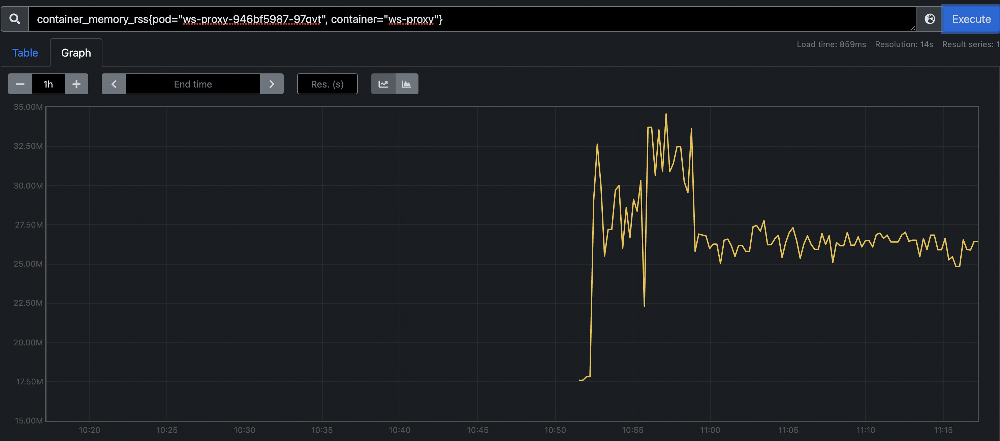

# SSH Gateway load test

## Notice

All cases need to observe cpu and memory of the `ws-proxy`

Remember to delete workspaces after test, since they are always active

## How to observe

port-forward prometheus 9090 to local, and search graph with query like

container_memory_rss(pod="`<ws-proxy-pod-name>`", container="ws-proxy"}

container_cpu_rss(pod="`<ws-proxy-pod-name>`", container="ws-proxy"}

## Prepare

Prepare workspace pair AB like this:

1. We need to keep workspace alive, so edit gitpod-cli to build a new tmp exec file with command to keep heartbeat: send heartbeat every 30 seconds
2. Open a workspace `A` as target workspace, copy file that step1 produce to it, and exec file to keep it alive
3. Open a workspace `B`, repeat step 2


## Test cases

Testing in prev envs and test several cases:

1. Many connections to learn the cost of single connection in terms of memory and CPU

    For B, write ssh connect script with connect num 10000

    ```sh
    go run main.go -u <workspace_url> -t <owner_token> -n <connection_num> lotconn
    ```

    🟢 After 10000 connect exec, **`ws-proxy` works fine**, target workspace works fine, (but sender's workspace network broken)
    > `wait: remote command exited without exit status or exit signal` appear after exec command, maybe ssh gateway still has some difference with real ssh
    > Fixed with [PR](https://github.com/gitpod-io/gitpod/pull/7772)

2. Several connection with huge amount of data back and forth

    Simply exec scp with large file (`dd if=/dev/zero of=test bs=1M count=1000`) from A to B and B to A several times

    🟢 scp 1G data works fine several times

3. Several connections and see how long they can stay alive with heartbeat

    For B, open several terminals connect to A and exec command like `htop`

    🟢 7 tasks of ssh command htop work and stable in 20 hours

4. Try dropping and reopening connections to see whether ws-proxy leaks memory on such connections

    ```sh
    go run main.go -u <workspace_url> -t <owner_token> -c <concurrent_num> reopen
    ```

    🟠 Memory leak appeared and fixed by [this commit](https://github.com/gitpod-io/gitpod/pull/7772/commits/e5c3defe2588774cf713b948f0dac35ef94350e9)

    After fix

    


